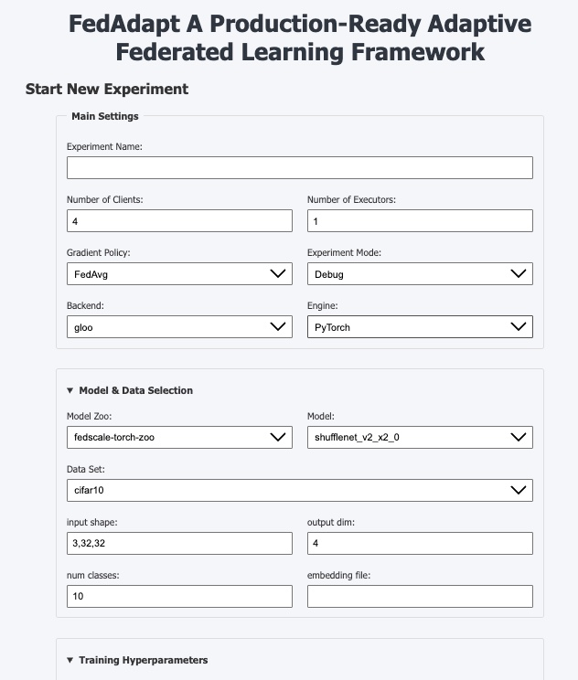
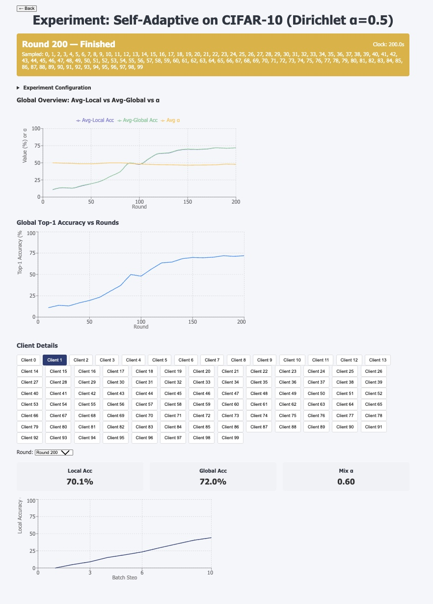

<!-- ````markdown -->
# Live Dashboard

> FedAdapt’s real-time web UI to launch and monitor federated experiments.

---

## 🚀 Quick Start

### 1. Backend

```bash
cd dashboard-backend
pip install -r requirements.txt
uvicorn app.main:app --reload --port 8000
<!-- ```` -->

### 2. Frontend

```bash
cd dashboard-frontend
npm install
npm run dev
```

Your dashboard will be available at:

* **Backend API:** `http://localhost:8000`
* **Frontend UI:** `http://localhost:3000`

---

## 🏗 Architecture Overview

```
┌──────────────────────┐      gRPC      ┌────────────────────┐
│  FastAPI / Uvicorn   │◀──────────────▶│  FedScale Aggregator│
│ (dashboard-backend)  │                │    & Executor      │
└──────────────────────┘                └────────────────────┘
         │
         │ HTTP / SSE
         ▼
┌──────────────────────┐
│  React + Vite        │
│ (dashboard-frontend) │
└──────────────────────┘
```

* **dashboard-backend**

  * FastAPI (REST + Server-Sent Events)
  * Spawns FedScale Aggregator & Executor processes
  * Proxies gRPC to HTTP/SSE endpoints

* **dashboard-frontend**

  * React + Vite
  * Axios for REST calls
  * EventSource for live updates (SSE)
  * React Router for navigation

---

## 🔌 Backend Endpoints

| Method   | Path                                  | Description                                  |
| :------- | :------------------------------------ | :------------------------------------------- |
| **POST** | `/experiments`                        | Start a new experiment                       |
| **GET**  | `/experiments`                        | List active experiments                      |
| **POST** | `/experiments/{id}/stop`              | Stop a running experiment                    |
| **GET**  | `/experiments/{id}/status`            | Current round, running flag, sampled clients |
| **GET**  | `/experiments/{id}/round/{r}/metrics` | Metrics for round `r`                        |
| **GET**  | `/experiments/{id}/stream`            | SSE stream of status & metrics               |
| **GET**  | `/experiments/{id}/data`              | Raw JSON payloads from `data/{id}/`          |
| **GET**  | `/experiments/{static_id}/static`     | Static results for completed experiments     |
| **GET**  | `/health`                             | Health check → `{"status":"ok"}`             |

### ExperimentStartRequest schema

```jsonc
{
  "name": "string",
  "num_executors": 1,
  "num_clients": 4,
  "gradient_policy": "FedAvg",
  "experiment_mode": "SIMULATION",
  "backend": "gloo",
  "engine": "pytorch",
  "model_zoo": "vision",
  "model": "resnet18",
  "data_set": "cifar10",
  "data_dir": "/data",
  "input_shape": "3,32,32",
  "output_dim": 10,
  "num_classes": 10,
  "rounds": 5,
  "local_steps": 1,
  "batch_size": 8,
  "eval_interval": 1,
  "optimize_for": "Balanced",
  "compression_limit": 0.5,
  "auto_tune": true,
  "alpha_threshold": 0.02,
  "alpha_step": 0.10
}
```

---

## 🖥️ UI Walkthrough

### 1. Start New Experiment



* **Main Settings**: experiment name, number of clients/executors, FL mode
* **Model & Data**: select model zoo, dataset, input shape, classes
* **Training Hyperparameters**: rounds, batch size, learning rate, etc.
* **Heterogeneity Co-Opt**: optimization target, compression limit
* **Self-Adaptive Personalization**: α threshold & step

Click **Start Experiment** → you’ll be redirected to the live metrics view.

---

### 2. Completed Experiments



* Expand each experiment group
* Click a variant to view its static results page

---

### 3. Live Metrics

<!--  -->

* **Global Charts**: test loss & accuracy vs. round
* **Client Panels**: per-client loss, duration, α trajectories
* **Bandwidth Savings** (when compression is enabled)
* **Straggler Profiles**: visualizing slow clients

All live updates stream over SSE from `/experiments/{id}/stream`.

---

## 🔧 Production Notes

* **CORS** is currently unrestricted (`allow_origins: ["*"]`)—lock it down for production.
* Ensure the FedScale aggregator gRPC server is listening on `127.0.0.1:50051`.

---

<small>Next up: [Self-Adaptive Personalization](personalization.md)</small>

```
```
